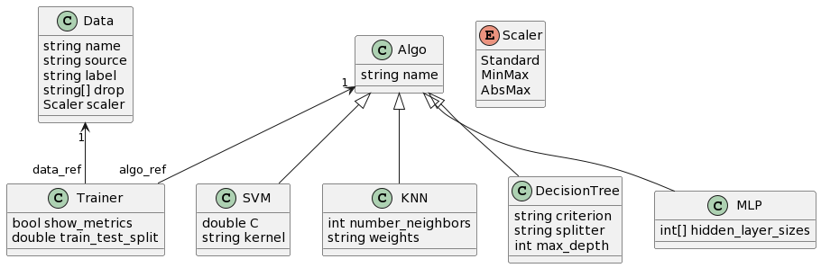

# DSL-ML-classif

## Domain analysis

### Java

TensorFlow is an open-source library developed by Google that is widely used in the field of machine learning and deep learning. The Java version of TensorFlow allows Java developers to benefit from the TensorFlow ecosystem while working in their preferred language.

Official website : https://www.tensorflow.org/jvm/install?hl=fr 

Example : https://github.com/tensorflow/java-models/blob/master/tensorflow-examples/src/main/java/org/tensorflow/model/examples/regression/linear/LinearRegressionExample.java
<details>
<summary>Open code example</summary>

```java
package org.tensorflow.model.examples.regression.linear;

import java.util.List;
import java.util.Random;
import org.tensorflow.Graph;
import org.tensorflow.Session;
import org.tensorflow.framework.optimizers.GradientDescent;
import org.tensorflow.framework.optimizers.Optimizer;
import org.tensorflow.ndarray.Shape;
import org.tensorflow.op.Op;
import org.tensorflow.op.Ops;
import org.tensorflow.op.core.Placeholder;
import org.tensorflow.op.core.Variable;
import org.tensorflow.op.math.Add;
import org.tensorflow.op.math.Div;
import org.tensorflow.op.math.Mul;
import org.tensorflow.op.math.Pow;
import org.tensorflow.types.TFloat32;

/**
 * In this example TensorFlow finds the weight and bias of the linear regression during 1 epoch,
 * training on observations one by one.
 * <p>
 * Also, the weight and bias are extracted and printed.
 */
public class LinearRegressionExample {
    /**
     * Amount of data points.
     */
    private static final int N = 10;

    /**
     * This value is used to fill the Y placeholder in prediction.
     */
    public static final float LEARNING_RATE = 0.1f;
    public static final String WEIGHT_VARIABLE_NAME = "weight";
    public static final String BIAS_VARIABLE_NAME = "bias";

    public static void main(String[] args) {
        // Prepare the data
        float[] xValues = {1f, 2f, 3f, 4f, 5f, 6f, 7f, 8f, 9f, 10f};
        float[] yValues = new float[N];

        Random rnd = new Random(42);

        for (int i = 0; i < yValues.length; i++) {
            yValues[i] = (float) (10 * xValues[i] + 2 + 0.1 * (rnd.nextDouble() - 0.5));
        }

        try (Graph graph = new Graph()) {
            Ops tf = Ops.create(graph);

            // Define placeholders
            Placeholder<TFloat32> xData = tf.placeholder(TFloat32.class, Placeholder.shape(Shape.scalar()));
            Placeholder<TFloat32> yData = tf.placeholder(TFloat32.class, Placeholder.shape(Shape.scalar()));

            // Define variables
            Variable<TFloat32> weight = tf.withName(WEIGHT_VARIABLE_NAME).variable(tf.constant(1f));
            Variable<TFloat32> bias = tf.withName(BIAS_VARIABLE_NAME).variable(tf.constant(1f));

            // Define the model function weight*x + bias
            Mul<TFloat32> mul = tf.math.mul(xData, weight);
            Add<TFloat32> yPredicted = tf.math.add(mul, bias);

            // Define loss function MSE
            Pow<TFloat32> sum = tf.math.pow(tf.math.sub(yPredicted, yData), tf.constant(2f));
            Div<TFloat32> mse = tf.math.div(sum, tf.constant(2f * N));

            // Back-propagate gradients to variables for training
            Optimizer optimizer = new GradientDescent(graph, LEARNING_RATE);
            Op minimize = optimizer.minimize(mse);

            try (Session session = new Session(graph)) {

                // Train the model on data
                for (int i = 0; i < xValues.length; i++) {
                    float y = yValues[i];
                    float x = xValues[i];

                    try (TFloat32 xTensor = TFloat32.scalarOf(x);
                         TFloat32 yTensor = TFloat32.scalarOf(y)) {

                        session.runner()
                                .addTarget(minimize)
                                .feed(xData.asOutput(), xTensor)
                                .feed(yData.asOutput(), yTensor)
                                .run();

                        System.out.println("Training phase");
                        System.out.println("x is " + x + " y is " + y);
                    }
                }

                // Extract linear regression model weight and bias values
                List<?> tensorList = session.runner()
                        .fetch(WEIGHT_VARIABLE_NAME)
                        .fetch(BIAS_VARIABLE_NAME)
                        .run();

                try (TFloat32 weightValue = (TFloat32)tensorList.get(0);
                     TFloat32 biasValue = (TFloat32)tensorList.get(1)) {

                    System.out.println("Weight is " + weightValue.getFloat());
                    System.out.println("Bias is " + biasValue.getFloat());
                }

                // Let's predict y for x = 10f
                float x = 10f;
                float predictedY = 0f;

                try (TFloat32 xTensor = TFloat32.scalarOf(x);
                     TFloat32 yTensor = TFloat32.scalarOf(predictedY);
                     TFloat32 yPredictedTensor = (TFloat32)session.runner()
                             .feed(xData.asOutput(), xTensor)
                             .feed(yData.asOutput(), yTensor)
                             .fetch(yPredicted)
                             .run().get(0)) {

                    predictedY = yPredictedTensor.getFloat();

                    System.out.println("Predicted value: " + predictedY);
                }
            }
        }
    }
}
```
</details>

---

### C++

For classification tasks in machine learning, C++ offers several advantages: Performance, Control, Integration. The most commonly used libraries are TensorFlow, PyTorch, DLIB, Shark, and MLPack. Shark is a high-performance open-source library for machine learning and optimization, written in C++. It is designed to provide a wide range of tools and algorithms for various machine learning tasks, including classification, regression, clustering, dimensionality reduction, and much more.

#### Neural network example
Source : [shark-ml doc](http://image.diku.dk/shark/doxygen_pages/html/_f_f_n_n_basic_tutorial_8cpp_source.html )
<details>
	<summary>Open code example for neural network</summary>

```cpp

#include <shark/Models/LinearModel.h>//single dense layer
#include <shark/Models/ConcatenatedModel.h>//for stacking layers, provides operator>>
//training the  model
#include <shark/ObjectiveFunctions/ErrorFunction.h>//error function, allows for minibatch training
#include <shark/ObjectiveFunctions/Loss/CrossEntropy.h> // loss used for supervised training
#include <shark/ObjectiveFunctions/Loss/ZeroOneLoss.h> // loss used for evaluation of performance
#include <shark/Algorithms/GradientDescent/Adam.h> //optimizer: simple gradient descent.
#include <shark/Data/SparseData.h> //loading the dataset
using namespace shark;

std::size_t batchSize = 256;
LabeledData<RealVector,unsigned int> data;
importSparseData( data, argv[1], 0, batchSize );
data.shuffle(); //shuffle data randomly
auto test = splitAtElement(data, 70 * data.numberOfElements() / 100);//split a test set
std::size_t numClasses = numberOfClasses(data);
std::size_t inputDim = inputDimension(data);

//We use a dense linear model with rectifier activations
typedef LinearModel<RealVector, RectifierNeuron> DenseLayer;

//build the network
DenseLayer layer1(inputDim,hidden1, true);
DenseLayer layer2(hidden1,hidden2, true);
LinearModel<RealVector> output(hidden2,numClasses, true);
auto network = layer1 >> layer2 >> output;

//create the supervised problem.
CrossEntropy<unsigned int, RealVector> loss;
ErrorFunction<> error(data, &network, &loss, true);//enable minibatch training

//optimize the model
std::cout<<"training network"<<std::endl;
initRandomNormal(network,0.001);
Adam<> optimizer;
error.init();
optimizer.init(error);
for(std::size_t i = 0; i != iterations; ++i){
        optimizer.step(error);
        std::cout<<i<<" "<<optimizer.solution().value<<std::endl;
}
network.setParameterVector(optimizer.solution().point);
```
</details>

#### kNN example
Source : [shark-ml doc](http://image.diku.dk/shark/doxygen_pages/html/_k_n_n_tutorial_8cpp_source.html )

<details>
	<summary>Open code example for kNN</summary>

```cpp

 #include <shark/Data/Csv.h>
 #include <shark/Models/NearestNeighborModel.h>
 #include <shark/Algorithms/NearestNeighbors/TreeNearestNeighbors.h>
 #include <shark/Models/Trees/KDTree.h>
 #include <shark/ObjectiveFunctions/Loss/ZeroOneLoss.h>
 #include <shark/Data/DataView.h>
 #include <iostream>
 
 using namespace shark;
 using namespace std;
 
 int main(int argc, char **argv) {
  if(argc < 2) {
  cerr << "usage: " << argv[0] << " (filename)" << endl;
  exit(EXIT_FAILURE);
  }
  // read data
  ClassificationDataset data;
  try {
  importCSV(data, argv[1], LAST_COLUMN, ' ');
  }
  catch (...) {
  cerr << "unable to read data from file " << argv[1] << endl;
  exit(EXIT_FAILURE);
  }
 
  cout << "number of data points: " << data.numberOfElements()
  << " number of classes: " << numberOfClasses(data)
  << " input dimension: " << inputDimension(data) << endl;
 
  // split data into training and test set
  ClassificationDataset dataTest = splitAtElement(data, static_cast<std::size_t>(.5 * data.numberOfElements()));
  cout << "training data points: " << data.numberOfElements() << endl;
  cout << "test data points: " << dataTest.numberOfElements() << endl;
 
  //create a binary search tree and initialize the search algorithm - a fast tree search
  KDTree<RealVector> tree(data.inputs());
  TreeNearestNeighbors<RealVector,unsigned int> algorithm(data,&tree);
  //instantiate the classifier
  const unsigned int K = 1; // number of neighbors for kNN
  NearestNeighborModel<RealVector, unsigned int> KNN(&algorithm,K);
 
  // evaluate classifier
  ZeroOneLoss<unsigned int> loss;
  Data<unsigned int> prediction = KNN(data.inputs());
  cout << K << "-KNN on training set accuracy: " << 1. - loss.eval(data.labels(), prediction) << endl;
  prediction = KNN(dataTest.inputs());
  cout << K << "-KNN on test set accuracy: " << 1. - loss.eval(dataTest.labels(), prediction) << endl;
 }

```
</details>

#### SVM example, with cross-validation
Source : [shark-ml doc](http://image.diku.dk/shark/doxygen_pages/html/_c_svm_grid_search_tutorial_8cpp_source.html )

<details>
	<summary>Open code example for SVM with cross validation</summary>

```cpp

#include <shark/Models/Kernels/GaussianRbfKernel.h>
#include <shark/ObjectiveFunctions/Loss/ZeroOneLoss.h>
#include <shark/Algorithms/Trainers/CSvmTrainer.h>
#include <shark/Data/DataDistribution.h>

#include <shark/ObjectiveFunctions/CrossValidationError.h>
#include <shark/Algorithms/DirectSearch/GridSearch.h>
#include <shark/Algorithms/JaakkolaHeuristic.h>

using namespace shark;
using namespace std;

int main() {
    // problem definition
    Chessboard prob;
    ClassificationDataset dataTrain = prob.generateDataset(200);
    ClassificationDataset dataTest = prob.generateDataset(10000);

    // SVM setup
    GaussianRbfKernel<> kernel(0.5, true); // unconstrained?
    KernelClassifier<RealVector> svm;
    bool offset = true;
    bool unconstrained = true;
    CSvmTrainer<RealVector> trainer(&kernel, 1.0, offset, unconstrained);

    // cross-validation error
    const unsigned int K = 5; // number of folds
    ZeroOneLoss<unsigned int> loss;
    CVFolds<ClassificationDataset> folds = createCVSameSizeBalanced(dataTrain, K);
    CrossValidationError<KernelClassifier<RealVector>, unsigned int> cvError(
        folds, &trainer, &svm, &trainer, &loss
    );

    // find best parameters

    // use Jaakkola's heuristic as a starting point for the grid-search
    JaakkolaHeuristic ja(dataTrain);
    double ljg = log(ja.gamma());
    cout << "Tommi Jaakkola says gamma = " << ja.gamma() << " and ln(gamma) = " << ljg << endl;

    GridSearch grid;
    vector<double> min(2);
    vector<double> max(2);
    vector<size_t> sections(2);
    // kernel parameter gamma
    min[0] = ljg - 4.; max[0] = ljg + 4; sections[0] = 9;
    // regularization parameter C
    min[1] = 0.0; max[1] = 10.0; sections[1] = 11;
    grid.configure(min, max, sections);
    grid.step(cvError);

    // train model on the full dataset
    trainer.setParameterVector(grid.solution().point);
    trainer.train(svm, dataTrain);
    cout << "grid.solution().point " << grid.solution().point << endl;
    cout << "C =\t" << trainer.C() << endl;
    cout << "gamma =\t" << kernel.gamma() << endl;

    // evaluate
    Data<unsigned int> output = svm(dataTrain.inputs());
    double train_error = loss.eval(dataTrain.labels(), output);
    cout << "training error:\t" << train_error << endl;
    output = svm(dataTest.inputs());
    double test_error = loss.eval(dataTest.labels(), output);
    cout << "test error: \t" << test_error << endl;
}

```
</details>

---

### Python
Python is a versatile interpreted programming language, renowned for its simple syntax that makes it easy to learn and read. It is widely used in web development, data science, task automation, and many other fields, thanks to its extensive standard library and active developer community. Among the libraries for machine learning, one can find Scikit-learn, TensorFlow, and PyTorch.

#### Scikit-learn ([official website](https://scikit-learn.org/stable/))
Scikit-learn is one of the most popular Python libraries for machine learning. It provides a wide range of tools and algorithms for data processing, supervised and unsupervised learning, dimensionality reduction, model selection, model evaluation, and much more. Scikit-learn is designed to be user-friendly, yet it remains powerful and flexible for solving complex machine learning tasks. It is used in various fields, including data analysis, image classification, anomaly detection, bioinformatics, finance, and many others.

##### Code example for recognition of handwritten digits
Source : [scikit-learn doc](https://scikit-learn.org/stable/auto_examples/classification/plot_digits_classification.html#sphx-glr-auto-examples-classification-plot-digits-classification-py)

<details>
	<summary>Open code example</summary>

```python
# Author: Gael Varoquaux <gael dot varoquaux at normalesup dot org>
# License: BSD 3 clause

# Standard scientific Python imports
import matplotlib.pyplot as plt

# Import datasets, classifiers and performance metrics
from sklearn import datasets, metrics, svm
from sklearn.model_selection import train_test_split
```
##### Digits dataset
```python
digits = datasets.load_digits()

_, axes = plt.subplots(nrows=1, ncols=4, figsize=(10, 3))
for ax, image, label in zip(axes, digits.images, digits.target):
	ax.set_axis_off()
	ax.imshow(image, cmap=plt.cm.gray_r, interpolation="nearest")
	ax.set_title("Training: %i" % label)
```
##### Classification
```python
# flatten the images
n_samples = len(digits.images)
data = digits.images.reshape((n_samples, -1))

# Create a classifier: a support vector classifier
clf = svm.SVC(gamma=0.001)

# Split data into 50% train and 50% test subsets
X_train, X_test, y_train, y_test = train_test_split(
	data, digits.target, test_size=0.5, shuffle=False
)

# Learn the digits on the train subset
clf.fit(X_train, y_train)

# Predict the value of the digit on the test subset
predicted = clf.predict(X_test)
```
```python
# Visualization of the first 4 test samples and show their predicted digit value
_, axes = plt.subplots(nrows=1, ncols=4, figsize=(10, 3))
for ax, image, prediction in zip(axes, X_test, predicted):
	ax.set_axis_off()
	image = image.reshape(8, 8)
	ax.imshow(image, cmap=plt.cm.gray_r, interpolation="nearest")
	ax.set_title(f"Prediction: {prediction}")
```
```python
print(
	f"Classification report for classifier {clf}:\n"
	f"{metrics.classification_report(y_test, predicted)}\n"
)
```
```python
# Confusion matrix
disp = metrics.ConfusionMatrixDisplay.from_predictions(y_test, predicted)
disp.figure_.suptitle("Confusion Matrix")
print(f"Confusion matrix:\n{disp.confusion_matrix}")

plt.show()
```
</details>

---

### Go

Go, also known as Golang, is an open-source programming language created by Google. It is distinguished by its simple syntax, efficient execution, and native support for concurrent programming with 'goroutines.' Go is widely used in backend development, web services, cloud applications, and command-line tools due to its simplicity, speed, and robustness. It also offers automatic memory management, reducing errors related to memory management.

#### GoLearn

"GoLearn ([repository](https://github.com/sjwhitworth/golearn)) is an open-source machine learning library developed in the Go (or Golang) programming language. It provides a set of features for creating, training, and evaluating machine learning models within the Go ecosystem."

#### Code example
Source : [golang doc](https://golangdocs.com/golang-machine-learning-libraries)
<details>
	<summary>Open code example</summary>

```go
package main
 
import (
    "fmt"
 
    "github.com/sjwhitworth/golearn/base"
    "github.com/sjwhitworth/golearn/evaluation"
    "github.com/sjwhitworth/golearn/knn"
)
 
func main() {
    // Load in a dataset, with headers. Header attributes will be stored.
    // Think of instances as a Data Frame structure in R or Pandas.
    // You can also create instances from scratch.
    rawData, err := base.ParseCSVToInstances("datasets/iris.csv", false)
    if err != nil {
        panic(err)
    }
 
    // Print a pleasant summary of your data.
    fmt.Println(rawData)
 
    //Initialises a new KNN classifier
    cls := knn.NewKnnClassifier("euclidean", "linear", 2)
 
    //Do a training-test split
    trainData, testData := base.InstancesTrainTestSplit(rawData, 0.50)
    cls.Fit(trainData)
 
    //Calculates the Euclidean distance and returns the most popular label
    predictions, err := cls.Predict(testData)
    if err != nil {
        panic(err)
    }
 
    // Prints precision/recall metrics
    confusionMat, err := evaluation.GetConfusionMatrix(testData, predictions)
    if err != nil {
        panic(fmt.Sprintf("Unable to get confusion matrix: %s", err.Error()))
    }
    fmt.Println(evaluation.GetSummary(confusionMat))
}

```
</details>

---

### Scala

Scala is a versatile programming language designed for conciseness and safety. It runs on the Java Virtual Machine (JVM) and provides a blend of object-oriented and functional features, making it a popular choice for data processing applications and the development of scalable systems.

#### Apache Spark MLlib

Apache Spark MLlib is an open-source machine learning library designed to work with the Apache Spark framework, using the Scala programming language. The integration of the library into the Apache Spark framework allows for leveraging clustering and parallelization to efficiently process massive volumes of data.

<details>
	<summary>Open code example</summary>

```scala
import org.apache.spark.ml.classification.LinearSVC

// Load training data
val training = spark.read.format("libsvm").load("data/mllib/sample_libsvm_data.txt")

val lsvc = new LinearSVC()
  .setMaxIter(10)
  .setRegParam(0.1)

// Fit the model
val lsvcModel = lsvc.fit(training)

// Print the coefficients and intercept for linear svc
println(s"Coefficients: ${lsvcModel.coefficients} Intercept: ${lsvcModel.intercept}")

```
</details>

---

### Comparative table

<details>
	<summary>Open table</summary>

| Characteristic                | scikit-learn (Python) | GoLearn (Go) | TensorFlow (Java) | Shark (C++) | MLlib (Scala) |
|------------------------------|-----------------------|--------------|--------------------|------------|--------------|
| Community and Support        | Large community and active support | Growing community | Active community | Growing community | Growing community |
| Machine Learning             | Yes, traditional methods | Yes, focused on decision trees and random forests | Yes, wide range of models | Yes, with libraries for numerical optimization | Yes, various methods |
| Deep Learning                | No, except with third-party extensions (like TensorFlow) | No, primarily focused on classical machine learning | Yes, with comprehensive deep learning capabilities | Yes, with deep learning capabilities | No, primarily focused on classical machine learning |
| Ease of Use                  | Very user-friendly, ideal for ML beginners | User-friendly but fewer resources for beginners | Slightly more complex, mainly for advanced users | User-friendly but may require C++ expertise | User-friendly, suitable for Scala users |
| Flexibility                  | Less flexible in terms of model customization | More flexibility than scikit-learn but less than TensorFlow | Highly flexible with the ability to customize every aspect of the model | Flexible with a wide variety of customizable parameters | Flexible with high-level and low-level APIs |
| Performance                  | Strong performance for basic tasks | Decent performance but not as powerful as TensorFlow | Exceptional performance, ideal for deep learning | Strong performance for classical machine learning | Strong performance for various tasks |
| Deployment                   | Easy to deploy in production due to its simplicity | Can be deployed but requires more effort than scikit-learn | Can be deployed but requires more complex management | Can be deployed with C++ deployment efforts | Can be deployed in the Spark ecosystem |
| Typical Use Cases            | Data exploration, classification, regression, clustering | Decision trees, random forests, classification | Neural networks, natural language processing, computer vision | Classical machine learning, numerical optimization | Various machine learning tasks |
</details>

## Expected features for our DSL

**Tasks**
- Load data
- Scale data
- Define parameters for an algo
- Train a model (specifying algo and data to use)
- Visualize the results

**Entry data**
- Tabular

**Use case scenarios**
- Train a model and visualize the results
- Train several models that may reference different or same data and algos (that are previously defined)

**Programs examples**

Very simple program
```
data myData {
   source = "C:/...";
   label = "myClassToPredict"; // if not specified, the last column of data will be taken as label
}
```
This program is valid but won't do anything as we don't ask to train any model.

A complete program
```
data myData {
	source = "C:/helloData"
        label = "myClassToPredict"
	drop = ["unusedFeature1", "unusedFeature2"];
	scaler = minMax;
}

data myData2 {
	source = "C:/holaData"
}
         
algo mySvmModel svm {
	C = 0.0
	kernel = sigmoid
}

algo myKnnModel knn {
	n_neighbors = 8
	weights = distance
}
         
trainer {
	data = data.myData
        model = algo.mySvmModel
        train_test_split = 0.7
}
```
Only the referenced data and algo blocks in a trainer will be used: in this case the myData and mySvmModel blocks. Blocks myData2 and myKnnModel aren't referenced in any trainer so they won't be taken into account.

A more complex program that train several models
```
data myData {
	source = "C:/helloData"
        label = "myClassToPredict"
	drop = ["unusedFeature1", "unusedFeature2"];
	scaler = minMax;
}

data myData2 {
	source = "C:/holaData"
}
         
algo mySvmModel svm {
	C = 0.0
	kernel = sigmoid
}

algo myKnnModel knn {
	n_neighbors = 8
	weights = distance
}
         
trainer {
	data = data.myData
        model = algo.mySvmModel
        train_test_split = 0.7
        show_metrics = true
}

trainer {
	data = data.myData2
	model = algo.myKnnModel
}
```
This time, myData2 and myKnnModel are referenced in a second trainer, so they will be used. Here, only the metrics about the SVM model will be printed.

## Metamodel



## Code generation with ChatGPT: success and limitations

We gave this prompt to ChatGPT:

> In order to do pieces of statements for machine learning in Python with scikit-learn, generate examples of programs for each of the following tasks :
> 
> 1 - load a CSV data file
> 
> 2 - load a CSV data file, part it between features and the labels column
> 
> 3 - idem as 2 but also dropping two columns: "unusedFeature1" and "unusedFeature2"
> 
> 4 - idem as 3 but also scaling data with MinMax scaler
> 
> 5 - idem as 2 and then train a SVM model with following parameters: C=1.0, kernel=sigmoid
> 
> 6 - idem as 5 visualize metrics about this trained model
> 
> 7 - idem as 5, but also load another CSV data file, train a KNN model with these data

The answer:
> Certainly! Here are example code snippets using scikit-learn to perform various tasks with machine learning:
> #### 1. Load a CSV data file:
> ```py
> import pandas as pd
> # Load CSV data into a DataFrame
> data = pd.read_csv('your_data.csv')
> ```
> #### 2. Load a CSV data file, separate features and labels:
> ```py
> import pandas as pd
> 
> # Load CSV data into a DataFrame
> data = pd.read_csv('your_data.csv')
>
> # Separate features and labels
> features = data.drop('label_column_name', axis=1)
> labels = data['label_column_name']
> ```
> #### 3. Separate features and labels, dropping two columns:
> ```py
> import pandas as pd
>
> # Load CSV data into a DataFrame
> data = pd.read_csv('your_data.csv')
>
> # Drop 'unusedFeature1' and 'unusedFeature2'
> data.drop(['unusedFeature1', 'unusedFeature2'], axis=1, inplace=True)
>
> # Separate features and labels
> features = data.drop('label_column_name', axis=1)
> labels = data['label_column_name']
> ```
> #### 4. Scale data with MinMaxScaler after dropping columns:
> ```py
> import pandas as pd
> from sklearn.preprocessing import MinMaxScaler
>
> # Load CSV data into a DataFrame
> data = pd.read_csv('your_data.csv')
>
> # Drop 'unusedFeature1' and 'unusedFeature2'
> data.drop(['unusedFeature1', 'unusedFeature2'], axis=1, inplace=True)
>
> # Separate features and labels
> features = data.drop('label_column_name', axis=1)
> labels = data['label_column_name']
>
> # Scale features using MinMaxScaler
> scaler = MinMaxScaler()
> scaled_features = scaler.fit_transform(features)
> ```
> #### 5. Train an SVM model with specified parameters:
> ```py
> from sklearn.svm import SVC
> import pandas as pd
>
> # Load CSV data into a DataFrame
> data = pd.read_csv('your_data.csv')
>
> # Separate features and labels
> features = data.drop('label_column_name', axis=1)
> labels = data['label_column_name']
>
> # Train SVM model
> svm = SVC(C=1.0, kernel='sigmoid')
> svm.fit(features, labels)
> ```
> #### 6. Visualize metrics for the trained SVM model:
> ```py
> import matplotlib.pyplot as plt
> from sklearn.metrics import plot_confusion_matrix
>
> # Assuming 'svm' is already trained
>
> # Visualize confusion matrix
> plot_confusion_matrix(svm, features, labels)
> plt.show()
> ```
> #### 7. Load another CSV data file, train a KNN model with this data:
> ```py
> from sklearn.neighbors import KNeighborsClassifier
> import pandas as pd
>
> # Load another CSV data into a DataFrame
> new_data = pd.read_csv('new_data.csv')
>
> # Separate features and labels for new data
> new_features = new_data.drop('new_label_column_name', axis=1)
> new_labels = new_data['new_label_column_name']
>
> # Train KNN model with new data
> knn = KNeighborsClassifier()
> knn.fit(new_features, new_labels)
> ```
>
> These examples cover loading CSV data, preprocessing, training different models, and visualizing model metrics. You might need to replace `'your_data.csv'`, `'new_data.csv'`, column names, and parameters with your specific data and values.

The code snippets provided generally work well by importing necessary modules and using appropriate variable names. However, some parts might not align with expectations, like assuming the SVM model is already trained in 6th section. This can be fixed with clearer prompts. The main challenge lies in users needing to give very specific details, like file paths and variable names. Also, without a clear structure, it might become confusing as users create more prompts, making it harder to refer back to previous steps or models they've trained. To make things smoother, using a DSL designed for these tasks would help. Additionally, unlike a program made with a dedicated language, there's no feature here to save prompts like you can in a system built on a specific grammar.
We didn't show examples for other languages and libraries, but the outcomes were alike.
